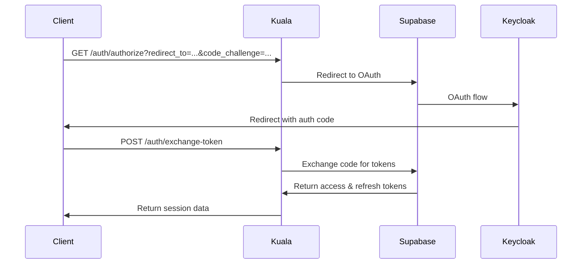

# Kuala API

[](https://opensource.org/licenses/MIT)
[](https://www.typescriptlang.org/)
[](https://supabase.com/)
[](https://deno.land/)

> **Public API for OAuth authentication, subscription management, and payment processing powered by Supabase and Kill Bill.**

## 🌟 Overview

Kuala API is a comprehensive backend service that provides:

- **🔐 OAuth Authentication** - Seamless login with Keycloak via Supabase
- **📋 Subscription Plans** - Flexible tier-based subscription management
- **💳 Payment Processing** - Integrated billing and invoicing with Kill Bill
- **🚀 Supabase Functions** - Serverless deployment with edge functions
- **📝 OpenAPI Spec** - Complete API documentation and type safety

### Architecture

``` bash
┌─────────────────┐    ┌─────────────────┐    ┌─────────────────┐
│   Client App    │───▶│   Kuala API     │───▶│   Supabase      │
│                 │    │ (Edge Functions)│    │   (Auth & DB)   │
└─────────────────┘    └─────────────────┘    └─────────────────┘
                                │
                                ▼
                       ┌─────────────────┐
                       │   Kill Bill     │
                       │   (Billing)     │
                       └─────────────────┘
```

## 🚀 Quick Start

### Prerequisites

- [Deno](https://deno.land/) (v1.37+)
- [Supabase CLI](https://supabase.com/docs/guides/cli) (v1.0+)
- [Git](https://git-scm.com/)

### Installation

1. **Clone the repository**

   ```bash
   git clone https://github.com/seribasa/kuala-api.git
   cd kuala-api
   ```

2. **Set up environment variables**

   ```bash
   cp .env.example .env
   # Edit .env with your actual values
   ```

3. **Start Supabase locally**

   ```bash
   supabase start
   ```

4. **Serve the functions**

   ```bash
   supabase functions serve --env-file .env
   ```

### Environment Configuration

Copy `.env.example` to `.env` and configure the following variables:

```bash
# Supabase Configuration
AUTH_BASE_URL=https://your-project-id.supabase.co
SUPABASE_ANON_KEY=your_supabase_anon_key_here

# Optional: Kill Bill Configuration (for billing features)
KILLBILL_URL=https://your-killbill-instance.com
KILLBILL_API_KEY=your_killbill_api_key
KILLBILL_API_SECRET=your_killbill_api_secret
```

## 📚 API Documentation

### Base URL

- **Staging**: `https://kuala-api-staging.seribasa.digital`
- **Local Development**: `http://localhost:54321/functions/v1/kuala`

### Authentication Flow



### Core Endpoints

#### 🔐 Authentication

| Method | Endpoint               | Description                   |
| ------ | ---------------------- | ----------------------------- |
| `GET`  | `/auth/authorize`      | Start OAuth flow              |
| `POST` | `/auth/exchange-token` | Exchange auth code for tokens |
| `POST` | `/auth/refresh-token`  | Refresh access token          |
| `POST` | `/auth/logout`         | Logout and revoke tokens      |
| `GET`  | `/auth/me`             | Get current user info         |

#### 📋 Subscription Management

| Method | Endpoint              | Description              |
| ------ | --------------------- | ------------------------ |
| `GET`  | `/plans`              | List available plans     |
| `POST` | `/subscriptions`      | Create subscription      |
| `GET`  | `/subscriptions/{id}` | Get subscription details |

#### 💳 Billing & Invoices

| Method | Endpoint             | Description          |
| ------ | -------------------- | -------------------- |
| `POST` | `/invoices`          | Generate invoice     |
| `GET`  | `/invoices/{id}`     | Get invoice details  |
| `GET`  | `/invoices/{id}/pdf` | Download invoice PDF |
| `POST` | `/invoices/{id}/pay` | Pay invoice          |

### Example Usage

#### 1. Start OAuth Flow

```bash
curl -X GET "https://kuala-api-staging.seribasa.digital/auth/authorize" \
  -H "Content-Type: application/json" \
  -d '{
    "redirect_to": "https://yourapp.com/callback",
    "code_challenge": "your_pkce_challenge"
  }'
```

#### 2. Exchange Authorization Code

```bash
curl -X POST "https://kuala-api-staging.seribasa.digital/auth/exchange-token" \
  -H "Content-Type: application/json" \
  -d '{
    "auth_code": "authorization_code_from_oauth",
    "code_verifier": "your_pkce_verifier"
  }'
```

#### 3. Get User Information

```bash
curl -X GET "https://kuala-api-staging.seribasa.digital/auth/me" \
  -H "Authorization: Bearer your_access_token"
```

## 🛠️ Development

### Project Structure

``` bash
kuala-api/
├── .env.example              # Environment variables template
├── LICENSE                   # MIT license
├── README.md                 # This file
├── docs/                     # Additional documentation
├── spec/                     # API specifications
│   ├── openapi.yml          # OpenAPI 3.0 specification
│   └── plans.xml            # Kill Bill plan definitions
├── supabase/
│   ├── config.toml          # Supabase configuration
│   └── functions/
│       ├── _shared/         # Shared types and utilities
│       │   └── types/
│       │       └── BaseResponse.ts
│       └── kuala/           # Main API function
│           ├── index.ts     # Entry point
│           └── handlers/    # Route handlers
│               └── auth/    # Authentication handlers
│                   ├── authorize.ts
│                   ├── exchange-token.ts
│                   ├── refresh-token.ts
│                   ├── logout.ts
│                   └── me.ts
└── infra/                   # Infrastructure configs
    └── killbill/
        └── docker-compose.yaml
```

### Running Tests

```bash
# Run all tests
deno test --allow-all

# Run specific test file
deno test --allow-all supabase/functions/kuala/handlers/auth/authorize.test.ts

# Run tests with coverage
deno test --allow-all --coverage=coverage
```

### Code Quality

This project follows TypeScript best practices:

- **Type Safety**: All handlers use proper TypeScript types
- **Error Handling**: Comprehensive error responses with proper HTTP status codes
- **Testing**: Unit tests for all handlers using Deno's testing framework
- **Documentation**: Complete OpenAPI specification

### Local Development

1. **Start Supabase stack**

   ```bash
   supabase start
   ```

2. **Serve functions with hot reload**

   ```bash
   supabase functions serve --env-file .env
   ```

3. **View logs**

   ```bash
   supabase functions logs kuala
   ```

4. **Reset database** (if needed)

   ```bash
   supabase db reset
   ```

## 📋 Subscription Plans

The API supports multiple subscription tiers:

| Plan           | Features                                       | Monthly Price |
| -------------- | ---------------------------------------------- | ------------- |
| **Free**       | Basic features, Generic Apps                   | $0            |
| **Basic**      | All Free + Published Apps, Landing Pages       | $9.99         |
| **Premium**    | All Basic + Business Process, Event Management | $49.99        |
| **Enterprise** | All Premium + Enterprise features              | Contact Us    |

### Plan Management

Plans are defined in Kill Bill and synchronized with the API. Each plan includes:

- ✅ Feature lists and capabilities
- 💰 Pricing in multiple currencies (USD, IDR)
- 🔄 Monthly and yearly billing options
- 🎯 Upgrade/downgrade paths

## 🔧 Configuration

### Supabase Setup

1. Create a new Supabase project
2. Configure OAuth providers (Keycloak)
3. Set up environment variables
4. Deploy functions

### Kill Bill Integration

1. Deploy Kill Bill instance
2. Configure plans and pricing
3. Set up webhooks for payment events
4. Configure API keys

### Environment Variables

| Variable              | Description            | Required |
| --------------------- | ---------------------- | -------- |
| `AUTH_BASE_URL`       | Supabase project URL   | Yes      |
| `SUPABASE_ANON_KEY`   | Supabase anonymous key | Yes      |
| `KILLBILL_URL`        | Kill Bill instance URL | Optional |
| `KILLBILL_API_KEY`    | Kill Bill API key      | Optional |
| `KILLBILL_API_SECRET` | Kill Bill API secret   | Optional |

## 🚀 Deployment

### Supabase Edge Functions

```bash
# Deploy to staging
supabase functions deploy kuala --project-ref your-project-ref

# Deploy to production
supabase functions deploy kuala --project-ref your-prod-project-ref
```

### Environment-Specific Deployment

```bash
# Set production environment variables
supabase secrets set AUTH_BASE_URL=https://prod.supabase.co
supabase secrets set SUPABASE_ANON_KEY=prod_key_here

# Deploy with production config
supabase functions deploy kuala
```

## 🤝 Contributing

We welcome contributions! Please see our [Contributing Guide](CONTRIBUTING.md) for details.

### Development Workflow

1. Fork the repository
2. Create a feature branch: `git checkout -b feature/amazing-feature`
3. Make your changes and add tests
4. Ensure all tests pass: `deno test --allow-all`
5. Commit your changes: `git commit -m 'Add amazing feature'`
6. Push to the branch: `git push origin feature/amazing-feature`
7. Open a Pull Request

### Code Standards

- Use TypeScript for all code
- Follow existing code style and patterns
- Add unit tests for new features
- Update documentation as needed
- Ensure all linting checks pass

## 📄 License

This project is licensed under the MIT License - see the [LICENSE](LICENSE) file for details.

## 🆘 Support

- **Documentation**: [API Docs](spec/openapi.yml)
- **Issues**: [GitHub Issues](https://github.com/seribasa/kuala-api/issues)
- **Discussions**: [GitHub Discussions](https://github.com/seribasa/kuala-api/discussions)

## 🔗 Related Projects

- [Supabase](https://supabase.com/) - Backend-as-a-Service platform
- [Kill Bill](https://killbill.io/) - Open-source billing platform
- [Deno](https://deno.land/) - Modern JavaScript/TypeScript runtime
- [Hono](https://hono.dev/) - Lightweight web framework

---
