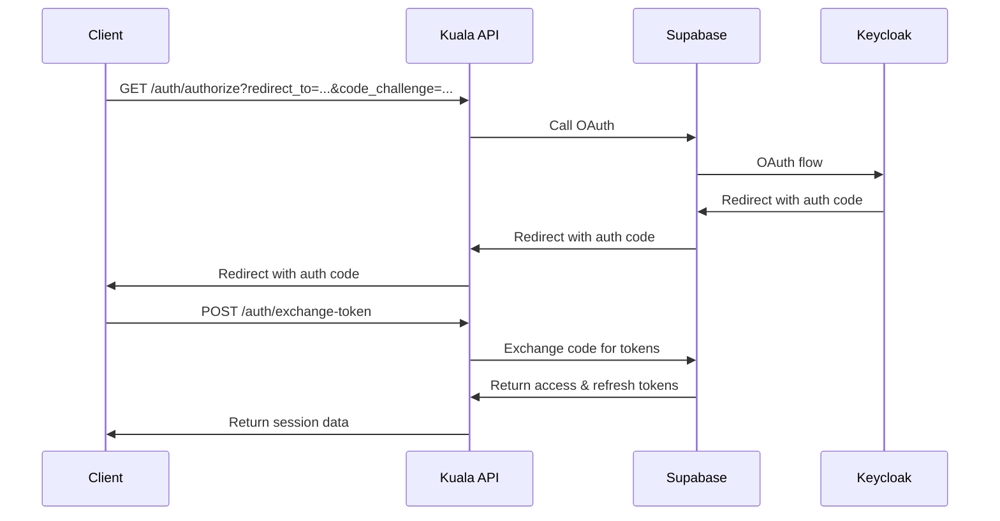

# Kuala API

[](https://opensource.org/licenses/MIT)
[](https://www.typescriptlang.org/)
[](https://supabase.com/)
[](https://deno.land/)

> **Public API for OAuth authentication, subscription management, and payment
> processing powered by Supabase and Kill Bill.**

## 🌟 Overview

Kuala API is a comprehensive backend service that provides:

- **🔐 OAuth Authentication** - Seamless login with Keycloak via Supabase
- **📋 Subscription Plans** - Flexible tier-based subscription management
- **💳 Payment Processing** - Integrated billing and invoicing with Kill Bill and Bayeu Payment Gateway
- **🚀 Supabase Functions** - Serverless deployment with edge functions
- **📝 OpenAPI Spec** - Complete API documentation and type safety

### Architecture

```bash
┌─────────────────┐    ┌─────────────────┐    ┌─────────────────┐
│   Client App    │───▶│   Kuala API     │───▶│   Supabase      │
│                 │    │ (Edge Functions)│    │   (Auth & DB)   │
└─────────────────┘    └─────────────────┘    └─────────────────┘
                        │               │
                        │               │
                        ▼               ▼
          ┌─────────────────┐    ┌─────────────────┐
          │   Kill Bill     │    │  Bayeu Payment  │
          │   (Billing)     │    │    Gateway      │
          └─────────────────┘    └─────────────────┘
```

## 🚀 Quick Start

### Prerequisites

- [Deno](https://deno.land/) (v1.37+)
- [Supabase CLI](https://supabase.com/docs/guides/cli) (v1.0+)
- [Docker](https://www.docker.com/get-started) (for local Supabase, Kill Bill, Keycloak)
- [Git](https://git-scm.com/)

### Installation

1. **Clone the repository**

   ```bash
   git clone https://github.com/seribasa/kuala-api.git
   cd kuala-api
   ```

2. **Set up environment variables**

   ```bash
   cp .env.example .env
   # Edit .env with your actual values
   ```

3. **Start Supabase locally**

   ```bash
   supabase start
   ```

4. **Serve the functions**

   ```bash
   supabase functions serve --env-file .env
   ```

### Environment Configuration

Copy `.env.example` to `.env` and configure. * see `.env.example` for required variables.

## 📚 API Documentation

### Base URL

- **Staging**: `https://kuala-api-staging.seribasa.digital/v1`
- **Local Development**: `http://localhost:54321/functions/v1/kuala`

### Authentication Flow



### Core Endpoints

#### 🔐 Authentication

| Method | Endpoint               | Description                   |
| ------ | ---------------------- | ----------------------------- |
| `GET`  | `/auth/authorize`      | Start OAuth flow              |
| `POST` | `/auth/exchange-token` | Exchange auth code for tokens |
| `POST` | `/auth/refresh-token`  | Refresh access token          |
| `POST` | `/auth/logout`         | Logout and revoke tokens      |
| `GET`  | `/auth/me`             | Get current user info         |

#### 📋 Subscription Management

| Method | Endpoint              | Description              |
| ------ | --------------------- | ------------------------ |
| `GET`  | `/plans`              | List available plans     |
| `POST` | `/subscriptions`      | Create subscription      |
| `GET`  | `/subscriptions/{id}` | Get subscription details |

#### 💳 Billing & Invoices

| Method | Endpoint             | Description          |
| ------ | -------------------- | -------------------- |
| `POST` | `/invoices`          | Generate invoice     |
| `GET`  | `/invoices/{id}`     | Get invoice details  |
| `GET`  | `/invoices/{id}/pdf` | Download invoice PDF |
| `POST` | `/invoices/{id}/pay` | Pay invoice          |

### Example Usage

#### 1. Start OAuth Flow

How to generate `code_challenge` and `code_verifier` see this [helpers.ts](https://github.com/supabase/auth-js/blob/1cbd43ec638a26ac59ae3908219927885be55ecb/src/lib/helpers.ts).

```bash
curl 'https://kuala-api-staging.seribasa.digital/v1/auth/authorize?redirect_to=https%3A%2F%2Fenakes-app.peltops.com&code_challenge=%3Cyour_code_challenge%3E' \
  -H "Content-Type: application/json"
```

#### 2. Exchange Authorization Code

```bash
curl -X POST "https://kuala-api-staging.seribasa.digital/v1/auth/exchange-token" \
  -H "Content-Type: application/json" \
  -d '{
    "auth_code": "authorization_code_from_oauth",
    "code_verifier": "your_pkce_verifier"
  }'
```

#### 3. Refresh Access Token

```bash
curl -X POST "https://kuala-api-staging.seribasa.digital/v1/auth/refresh-token" \
  -H "Content-Type: application/json" \
  -d '{
    "refresh_token": "your_refresh_token"
  }'
```

#### 4. Get User Information

```bash
curl -X GET "https://kuala-api-staging.seribasa.digital/v1/auth/me" \
  -H "Authorization: Bearer your_access_token"
```

## 🛠️ Development

### Project Structure

```bash
kuala-api/
├── .env.example              # Environment variables template
├── LICENSE                   # MIT license
├── README.md                 # This file
├── docs/                     # Additional documentation
├── spec/                     # API specifications
│   └── openapi.yml          # OpenAPI 3.0 specification
├── supabase/
│   ├── config.toml          # Supabase configuration
│   └── functions/
│       ├── tests/           # Unit tests
│       ├── _shared/         # Shared types and utilities
│       │   └── types/
│       │       └── BaseResponse.ts
│       └── kuala/           # Main API function
│           ├── index.ts     # Entry point
│           └── handlers/    # Route handlers
│               └── auth/    # Authentication handlers
│                   ├── authorize.ts
│                   ├── exchange-token.ts
│                   ├── refresh-token.ts
│                   ├── logout.ts
│                   └── me.ts
└── infra/                   # Infrastructure configs
    └── killbill/
        └── docker-compose.yaml
        └── plans.xml            # Kill Bill plan definitions
```

### Running Tests

```bash
# Run all tests
deno test --allow-all

# Run specific test file
deno test --allow-all supabase/functions/kuala/handlers/auth/authorize.test.ts

# Run tests with coverage
deno test --allow-all --coverage=coverage
```

### Code Quality

This project follows TypeScript best practices:

- **Type Safety**: All handlers use proper TypeScript types
- **Error Handling**: Comprehensive error responses with proper HTTP status
  codes
- **Testing**: Unit tests for all handlers using Deno's testing framework
- **Documentation**: Complete OpenAPI specification

### Local Development

1. **Start Supabase stack**

   ```bash
   supabase start
   ```

2. **Serve functions with hot reload**

   ```bash
   supabase functions serve --env-file .env
   ```

3. **View logs**

   ```bash
   supabase functions logs kuala
   ```

4. **Reset database** (if needed)

   ```bash
   supabase db reset
   ```

## 📋 Subscription Plans

The API supports multiple subscription tiers:

| Plan           | Features                                       | Monthly Price |
| -------------- | ---------------------------------------------- | ------------- |
| **Free**       | Basic features, Generic Apps                   | $0            |
| **Basic**      | All Free + Published Apps, Landing Pages       | $9.99         |
| **Premium**    | All Basic + Business Process, Event Management | $49.99        |
| **Enterprise** | All Premium + Enterprise features              | Contact Us    |

### Plan Management

Plans are defined in Kill Bill and synchronized with the API. Each plan
includes:

- ✅ Feature lists and capabilities
- 💰 Pricing in multiple currencies (USD, IDR)
- 🔄 Monthly and yearly billing options
- 🎯 Upgrade/downgrade paths

## 🔧 Configuration

### Supabase Setup

1. Create a new Supabase project
2. Configure OAuth providers (Keycloak)
3. Set up environment variables
4. Deploy functions

### Kill Bill Integration

1. Deploy Kill Bill instance
2. Configure plans and pricing
3. Set up webhooks for payment events
4. Configure API keys

### Environment Variables

| Variable                 | Description            | Required |
| ------------------------ | ---------------------- | -------- |
| `AUTH_BASE_URL`          | Supabase project URL   | Yes      |
| `AUTH_SUPABASE_ANON_KEY` | Supabase anonymous key | Yes      |
| `KILLBILL_URL`           | Kill Bill instance URL | Optional |
| `KILLBILL_API_KEY`       | Kill Bill API key      | Optional |
| `KILLBILL_API_SECRET`    | Kill Bill API secret   | Optional |

## 🚀 Deployment

### Supabase Edge Functions

```bash
# Deploy to staging
supabase functions deploy kuala --project-ref your-project-ref

# Deploy to production
supabase functions deploy kuala --project-ref your-prod-project-ref
```

### Environment-Specific Deployment

```bash
# Set production environment variables
supabase secrets set AUTH_BASE_URL=https://prod.supabase.co
supabase secrets set AUTH_SUPABASE_ANON_KEY=prod_key_here

# Deploy with production config
supabase functions deploy kuala
```

### Alternative Deployment Options

#### 🖥️ Deploy to Your Own Server

The API can run on any server that supports Deno. Here's how to deploy it as a
standalone application:

1. **Prepare the server environment**

   ```bash
   # Install Deno on your server
   curl -fsSL https://deno.land/install.sh | sh

   # Clone the repository
   git clone https://github.com/seribasa/kuala-api.git
   cd kuala-api
   ```

2. **Use the provided standalone server entry point**

    The repository ships with `infra/self-hosted/server.ts`:

    Copy it to your preferred location if you want to deploy from a different directory.

3. **Set up environment variables**

   ```bash
   # Create production environment file
   cp .env.example .env
   ```

4. **Run the server**

    ```bash
    # Development with auto-reload (watches supabase/functions and infra/self-hosted)
    cd supabase/functions && deno task dev

    # Production / one-off run
    cd supabase/functions && deno task start

    # Or run manually
    deno run --allow-net --allow-env --config=deno.json --env-file=../../.env ../../infra/self-hosted/server.ts

    # Production with PM2
    pm2 start "deno run --allow-net --allow-env --config=deno.json --env-file=../../.env ../../infra/self-hosted/server.ts" --name kuala-api

    # Or with systemd service
    sudo systemctl start kuala-api
    ```

5. **Nginx reverse proxy configuration**

   ```nginx
   server {
       listen 80;
       server_name api.yourdomain.com;

       location / {
           proxy_pass http://localhost:8080;
           proxy_http_version 1.1;
           proxy_set_header Upgrade $http_upgrade;
           proxy_set_header Connection 'upgrade';
           proxy_set_header Host $host;
           proxy_set_header X-Real-IP $remote_addr;
           proxy_set_header X-Forwarded-For $proxy_add_x_forwarded_for;
           proxy_set_header X-Forwarded-Proto $scheme;
           proxy_cache_bypass $http_upgrade;
       }
   }
   ```

#### ☁️ Deploy to Serverless Platforms

##### Deno Deploy

```bash
# Install Deno Deploy CLI
deno install --allow-all --global https://deno.land/x/deploy/deployctl.ts

# Deploy directly from GitHub
deployctl deploy --project=kuala-api https://raw.githubusercontent.com/seribasa/kuala-api/main/supabase/functions/kuala/index.ts

# Or deploy from local
deployctl deploy --project=kuala-api ./supabase/functions/kuala/index.ts
```

##### Vercel

1. **Create `vercel.json`**

   ```json
   {
     "functions": {
       "api/kuala.ts": {
         "runtime": "vercel-deno@0.8.1"
       }
     },
     "routes": [
       { "src": "/api/(.*)", "dest": "/api/kuala.ts" },
       { "src": "/(.*)", "dest": "/api/kuala.ts" }
     ]
   }
   ```

2. **Create `api/kuala.ts`**

   ```typescript
   import handler from "../supabase/functions/kuala/index.ts";

   export default handler;
   ```

3. **Deploy**

   ```bash
   # Install Vercel CLI
   npm i -g vercel

   # Deploy
   vercel --prod
   ```

##### Netlify

1. **Create `netlify.toml`**

   ```toml
   [build]
     command = "deno bundle supabase/functions/kuala/index.ts dist/bundle.js"
     functions = "netlify/functions"

   [[redirects]]
     from = "/api/*"
     to = "/.netlify/functions/kuala/:splat"
     status = 200

   [[redirects]]
     from = "/*"
     to = "/.netlify/functions/kuala/:splat"
     status = 200
   ```

2. **Create `netlify/functions/kuala.ts`**

   ```typescript
   import { Handler } from "@netlify/functions";
   import handler from "../../supabase/functions/kuala/index.ts";

   export const handler: Handler = async (event, context) => {
     const request = new Request(event.rawUrl, {
       method: event.httpMethod,
       headers: event.headers,
       body: event.body,
     });

     const response = await handler(request);

     return {
       statusCode: response.status,
       headers: Object.fromEntries(response.headers.entries()),
       body: await response.text(),
     };
   };
   ```

##### Railway

1. **Create `railway.toml`**

   ```toml
   [build]
     builder = "deno"

   [deploy]
     startCommand = "deno run --allow-all server.ts"
   ```

2. **Deploy**

   ```bash
   # Install Railway CLI
   npm install -g @railway/cli

   # Login and deploy
   railway login
   railway link
   railway up
   ```

##### Fly.io

1. **Create `fly.toml`**

   ```toml
   app = "kuala-api"
   primary_region = "sin"

   [build]
     image = "denoland/deno:alpine"

   [env]
     PORT = "8080"

   [[services]]
     internal_port = 8080
     protocol = "tcp"

     [[services.ports]]
       handlers = ["http"]
       port = 80

     [[services.ports]]
       handlers = ["tls", "http"]
       port = 443

     [services.concurrency]
       hard_limit = 25
       soft_limit = 20
   ```

2. **Create `Dockerfile`**

   ```dockerfile
   FROM denoland/deno:alpine

   WORKDIR /app
   COPY . .

   RUN deno cache --reload server.ts

   EXPOSE 8080

   CMD ["deno", "run", "--allow-all", "server.ts"]
   ```

3. **Deploy**

   ```bash
   # Install Fly CLI
   curl -L https://fly.io/install.sh | sh

   # Deploy
   fly deploy
   ```

#### 🐳 Docker Deployment

1. **Build and run**

   ```bash
   # Build image
   docker build -t kuala-api .

   # Run with docker-compose
   docker-compose up -d

   # Or run directly
   docker run -p 8080:8080 --env-file .env.production kuala-api
   ```

## 🤝 Contributing

We welcome contributions! Please see our [Contributing Guide](CONTRIBUTING.md)
for details.

### Development Workflow

1. Fork the repository
2. Create a feature branch: `git checkout -b feature/amazing-feature`
3. Make your changes and add tests
4. Ensure all tests pass: `deno test --allow-all`
5. Commit your changes: `git commit -m 'Add amazing feature'`
6. Push to the branch: `git push origin feature/amazing-feature`
7. Open a Pull Request

### Code Standards

- Use TypeScript for all code
- Follow existing code style and patterns
- Add unit tests for new features
- Update documentation as needed
- Ensure all linting checks pass

## 📄 License

This project is licensed under the Apache License - see the [LICENSE](LICENSE) file
for details.

## 🆘 Support

- **Documentation**: [API Docs](spec/openapi.yml)
- **Issues**: [GitHub Issues](https://github.com/seribasa/kuala-api/issues)
- **Discussions**:
  [GitHub Discussions](https://github.com/seribasa/kuala-api/discussions)

## 🔗 Related Projects

- [Supabase](https://supabase.com/) - Backend-as-a-Service platform
- [Keycloak](https://www.keycloak.org/) - Open-source identity and access management
- [Kill Bill](https://killbill.io/) - Open-source billing platform
- [Deno](https://deno.land/) - Modern JavaScript/TypeScript runtime
- [Hono](https://hono.dev/) - Lightweight web framework

---
