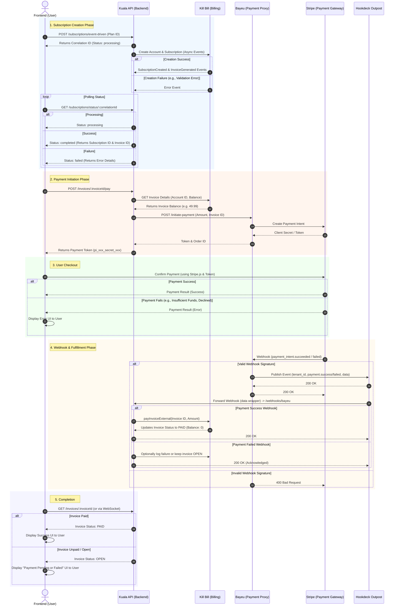

# Event-Driven Subscription & Payment Flow

This document details the end-to-end sequence diagram of the subscription and payment process, starting from the Frontend (FE) to the creation of the subscription, payment processing via Stripe, webhook handling through Hookdeck Outpost, and back to the FE.

## Sequence Diagram

## Flow Description

1. **Subscription Creation Phase**: The Frontend (FE) initiates an event-driven subscription request. The Kuala API acknowledges the request with a correlation ID and processes the Kill Bill subscription asynchronously. The FE polls the status until the subscription and initial invoice are fully generated.
   - *Negative Flow*: If Kill Bill fails to create the account or subscription (e.g., validation error), the error event is recorded. The FE polling will receive a `failed` status, and the user can be notified.
2. **Payment Initiation Phase**: The FE requests to pay the generated invoice. Kuala API fetches the invoice balance from Kill Bill and requests a payment initiation from the Bayeu payment proxy. Bayeu communicates with Stripe to create a Payment Intent and returns the client secret to the FE.
3. **User Checkout**: The FE securely captures the user's payment details (e.g., using Stripe Elements) and confirms the payment directly with Stripe.
   - *Negative Flow*: If the card is declined or has insufficient funds, Stripe returns an error directly to the FE. The FE displays an error message to the user, allowing them to retry with a different payment method.
4. **Webhook & Fulfillment Phase**: Upon payment resolution, Stripe fires a webhook to Bayeu. Bayeu standardizes the event and publishes it to Hookdeck Outpost. Outpost reliably routes the event back to Kuala API's webhook endpoint. Kuala API then marks the invoice as externally paid in Kill Bill, reducing its balance to zero.
   - *Negative Flow*: If the webhook signature is invalid or tampered with, Bayeu rejects it with a `400 Bad Request`. If a valid payment *failure* webhook is received, Kuala API acknowledges it but leaves the invoice in an `OPEN` state.
5. **Completion**: The FE either polls or is notified about the invoice status.
   - *Negative Flow*: If the invoice is still `OPEN` (due to payment failure or a delayed webhook), the FE displays a "Payment Pending or Failed" UI instead of the final success screen, prompting the user to check their payment status.
